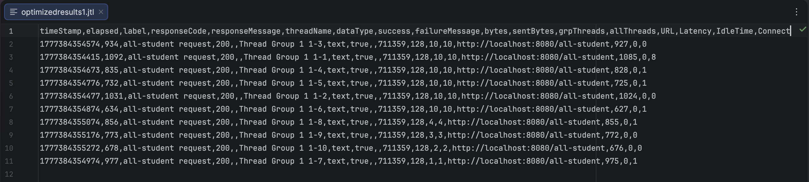
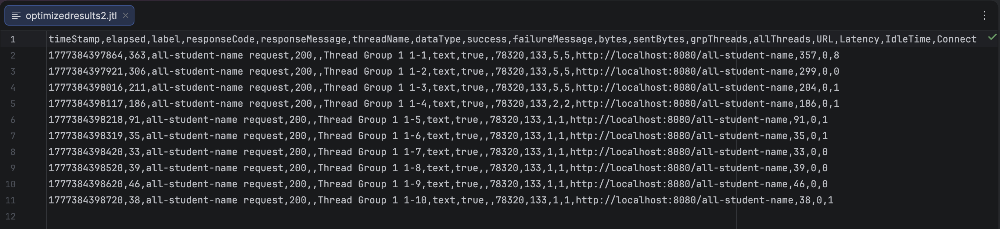
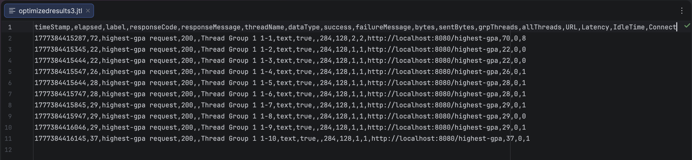

## Performance Testing Result
### all-student

Command line result:

Command line result after optimization:

Before (ms): 9478, 10292, 10405, 9749, 10552, 9926, 10050, 10274, 10397, 10515  
Avg before ≈ 10,164 ms

After (ms): 934, 1092, 835, 732, 1031, 634, 856, 773, 678, 977  
Avg after ≈ 854 ms

**Improvement:**  
**(10164 - 854) / 10164 × 100% ≈ 91.6%**
  
### all-student-name

Command line result:

Command line result after optimization:

Before (ms): 4381, 4283, 3982, 3885, 4083, 4185, 4481, 4739, 4581, 4680  
Avg before ≈ 4,328 ms

After (ms): 363, 306, 211, 186, 91, 35, 33, 39, 46, 38  
Avg after ≈ 135 ms

**Improvement:  
(4328 - 135) / 4328 × 100% ≈ 96.9%**
  
### highest-gpa

Command line result:

Command line result after optimization:

Before (ms): 198, 146, 43, 22, 27, 21, 22, 22, 18, 30  
Avg before ≈ 55 ms

After (ms): 72, 22, 22, 26, 28, 28, 29, 29, 29, 37  
Avg after ≈ 32 ms

**Improvement:  
(55 - 32) / 55 × 100% ≈ 41.8%**